# JellyJar

A clean, minimal Android media player that bridges Jellyfin with offline playback via
transcoded local copies.

## Screenshots

<table>
<tr>
<td width="50%">

**Home**
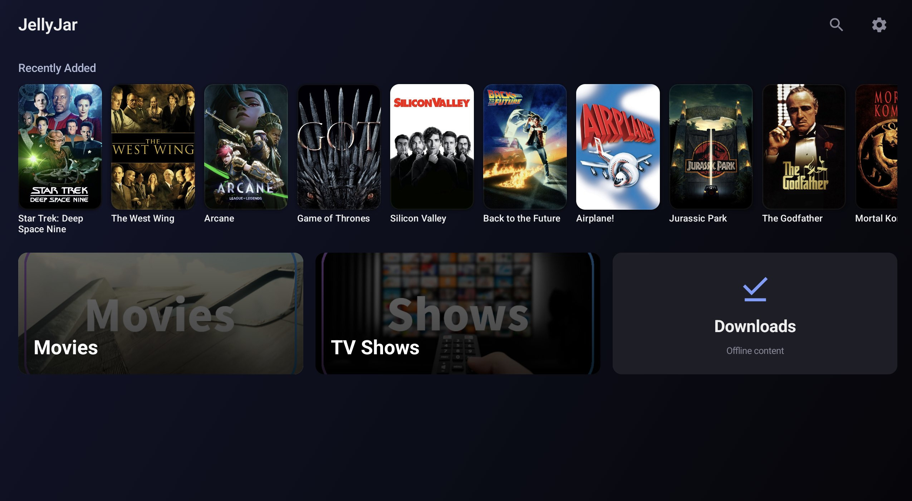

</td>
<td width="50%">

**Movies**
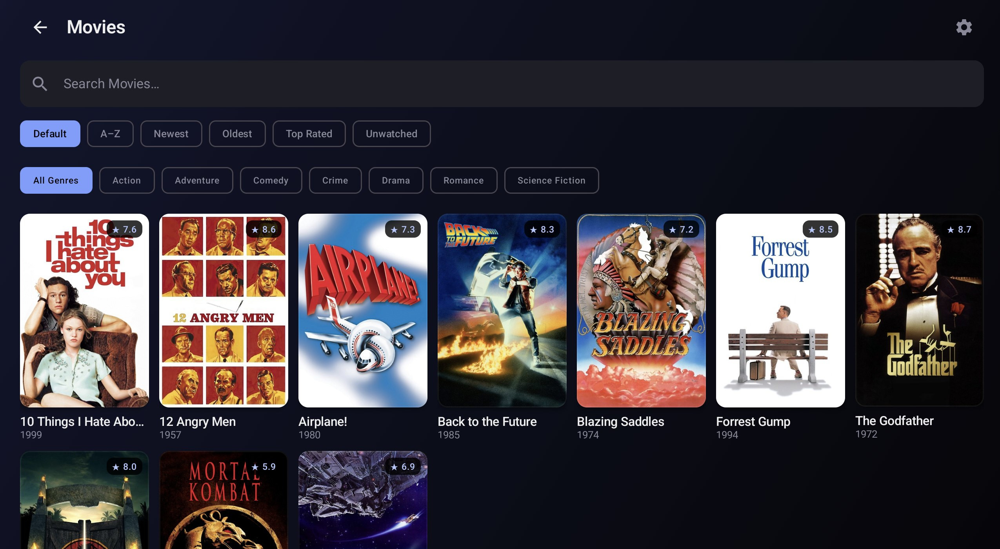

</td>
</tr>
<tr>
<td width="50%">

**Movie Detail**
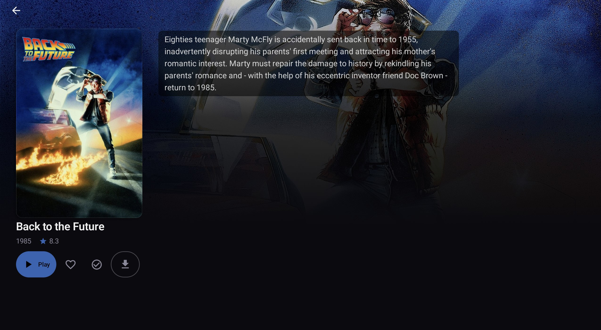

</td>
<td width="50%">

**TV Shows**
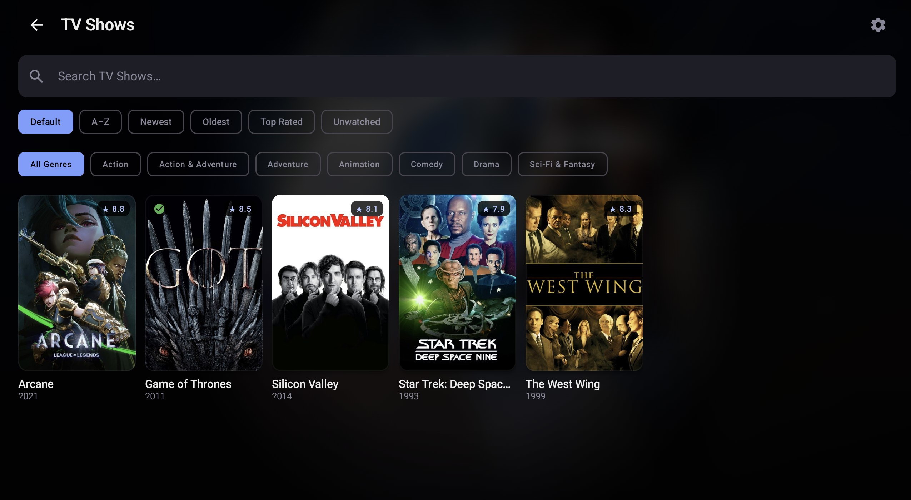

</td>
</tr>
<tr>
<td width="50%">

**Series Detail**
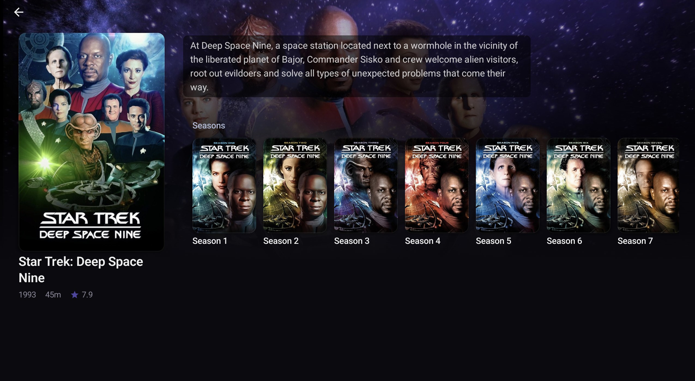

</td>
<td width="50%">

**Season Detail**
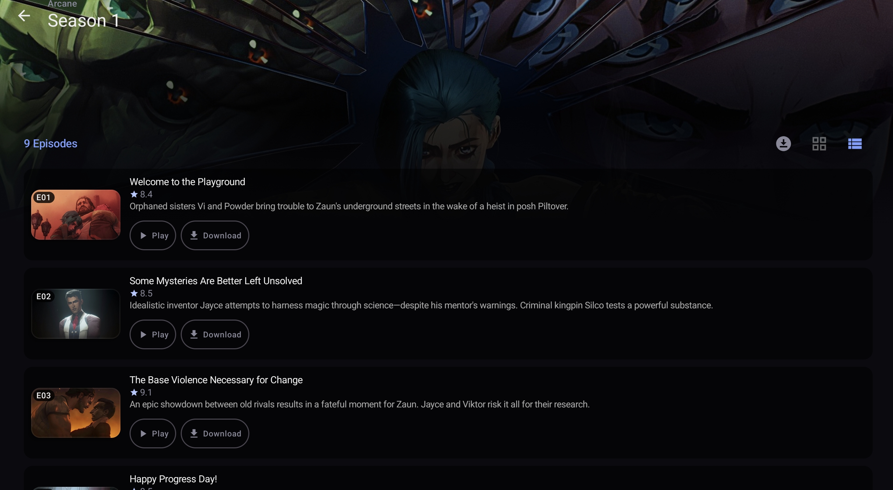

</td>
</tr>
<tr>
<td width="50%">

**Episode Detail**
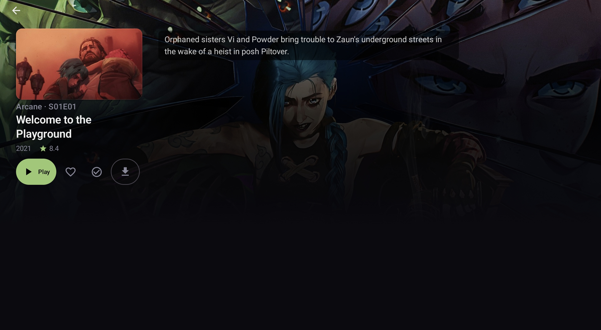

</td>
<td width="50%">

**Storage Management**
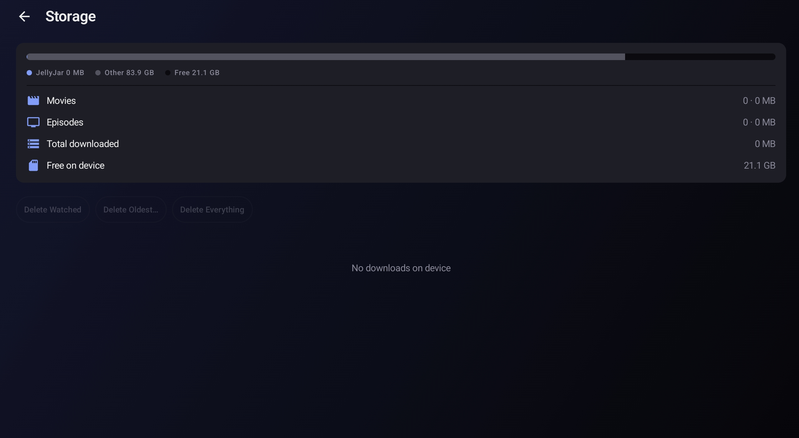

</td>
</tr>
<tr>
<td width="50%">

**Settings — Jellyfin Connection**
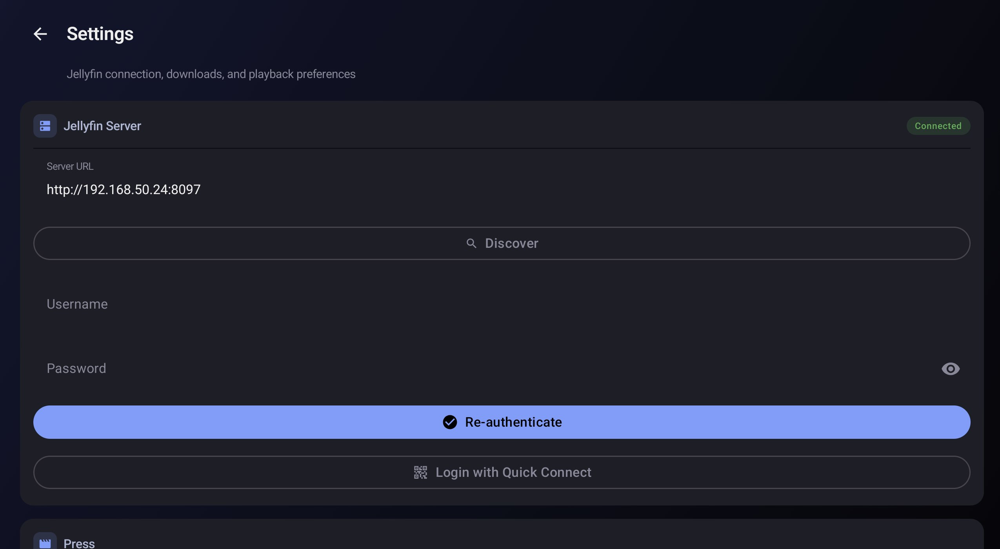

</td>
<td width="50%">

**Settings — Downloads & Home Screen**
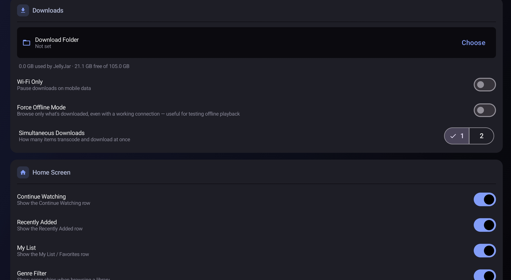

</td>
</tr>
<tr>
<td width="50%">

**Settings — Playback & PIN**
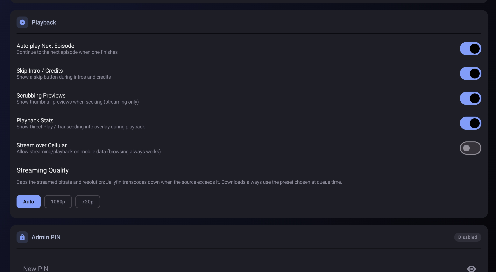

</td>
<td width="50%">

**Press Web Dashboard**
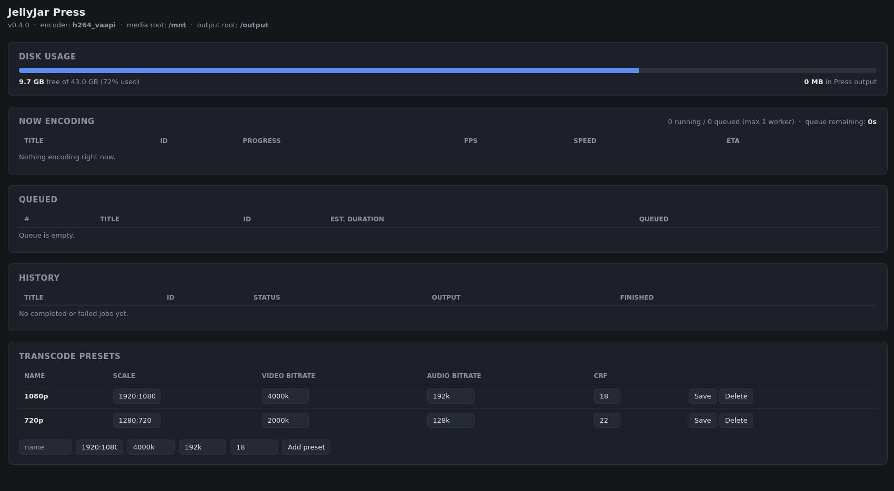

</td>
</tr>
</table>

## Architecture

```
Jellyfin Server  ──►  JellyJar Android App  ──►  local ExoPlayer playback
                              │
                         Press (ffmpeg)
                              │
                    shared Docker volume (same media as Jellyfin)
```

## Quick Start

### 1. Configure Press

Edit `docker-compose.yml` — point the volumes at your Jellyfin media root(s), mirroring the
paths Jellyfin itself uses so the paths returned by its API resolve correctly inside the
container:

```yaml
volumes:
  - /your/actual/movies/path:/mnt/movies:ro
  - /your/actual/tv/path:/mnt/tv:ro
```

Start Press:

```bash
docker compose up -d jellyjar-press
```

Verify it's running:

```bash
curl http://localhost:8090/health
```

By default Press transcodes one job at a time (most hardware encoders only support a single
session anyway). To allow more concurrent jobs, set `MAX_WORKERS` in `docker-compose.yml`:

```yaml
environment:
  MAX_WORKERS: 1   # concurrent transcode jobs
```

**Hardware encoding**: the image uses [jellyfin-ffmpeg](https://github.com/jellyfin/jellyfin-ffmpeg),
which bundles the Intel (iHD/i965) and AMD (radeonsi) VA-API drivers. The container exposes
`/dev/dri` for Intel/AMD VAAPI or QSV encoding (`LIBVA_DRIVER_NAME: iHD` is set for Intel gen8+
iGPUs — remove it on AMD). For NVIDIA, uncomment the `deploy.resources.reservations.devices`
block and install the NVIDIA Container Toolkit. Press probes for a working hardware encoder at
startup and falls back to `libx264` if none is found; set `ENCODER` explicitly to skip the
probe. `/health` reports which encoder is actually in use.

With NVENC or VAAPI, decoding and scaling run on the GPU as well (`-hwaccel cuda` + `scale_cuda`/
`pad_cuda`, or `-hwaccel vaapi` + `scale_vaapi`/`pad_vaapi`), so the CPU only handles audio and
subtitles. If that fails — typically a source the GPU can't decode, like 10-bit H.264 or AV1 on
an older card — the job retries automatically with CPU decode + GPU encode, then with `libx264`.
Set `HW_DECODE: 0` to skip the GPU-decode attempt entirely. QSV still decodes and scales on the
CPU. HDR sources are not tone-mapped on any path.

**Audio**: downloads are for tablets and phones, so every audio track is downmixed to stereo AAC
(a track that's already stereo AAC is copied as-is). Commentary tracks are dropped. Set
`AUDIO_LANGUAGES` (two- or three-letter codes, e.g. `en,ja` or `eng,jpn`) to keep only those
languages plus the source's default track and any untagged tracks; unset keeps every language. Audio is always
decoded and encoded on the CPU, so on remuxes with several lossless tracks this is the main
CPU cost left once video runs on the GPU.

**Distributed transcoding**: to spread jobs across several machines, run the same Press image
on each extra host in worker mode. One instance stays the *coordinator* (the only one the app
talks to); workers poll it for jobs, encode on their own GPU, and report back.

```yaml
# coordinator (your existing Press) — add:
environment:
  PRESS_ROLE: coordinator
  MAX_WORKERS: 1        # local slots; 0 = dispatch only, let the workers do all the encoding

# each worker host — see docker-compose.worker.yml:
environment:
  PRESS_ROLE: worker
  COORDINATOR_URL: http://<coordinator-host>:8090
```

Workers must see the **same media and output paths** as the coordinator (mount the media
read-only and the output directory as a shared NFS/SMB volume, at identical container paths).
If a worker can't see a file, the job fails with a message naming the missing path. A worker
that stops responding for 30s (`WORKER_LEASE_SECONDS`) has its job re-queued for another one.
As with Press itself, the worker API is unauthenticated — keep it on a trusted LAN.

Worker settings (all optional except `COORDINATOR_URL`):

| Variable | Default | Meaning |
|---|---|---|
| `COORDINATOR_URL` | — | Coordinator's base URL (required for `PRESS_ROLE=worker`) |
| `WORKER_NAME` | hostname | Name shown in the coordinator's dashboard |
| `MAX_WORKERS` | `1` | Concurrent encodes on this host |
| `ENCODER` | auto-detect | Pin the encoder instead of probing at startup |
| `HW_DECODE` | `1` | Decode + scale on the GPU with NVENC/VAAPI; `0` for CPU decode |
| `WORKER_LEASE_SECONDS` | `30` | Set on the coordinator: how long a silent worker keeps its job |
| `WORKER_HEARTBEAT_SECONDS` | `2` | How often a worker reports progress |
| `WORKER_POLL_SECONDS` | `3` | How often an idle worker asks for a job |

A coordinator restart re-queues jobs that were mid-encode on a worker; they start over.

**Job persistence**: job state is written to `$CONFIG_ROOT/jobs.json` on every status change, so
history survives container restarts. Any job still `queued`/`running` at startup is
automatically re-queued and restarted; if its preset or source file no longer exists, it's
marked `failed` instead. Set `CLEANUP_AFTER_DAYS` (default `0`, disabled) to auto-delete
completed jobs and their output files after N days.

### Web UI

Press serves a small built-in dashboard at `http://<press-host>:8090/` — no extra setup needed.
It shows:

- **Now Encoding** — jobs currently transcoding, with which worker is running each, live progress, FPS, encode speed, and ETA
- **Queued** — jobs waiting for a free worker, with position and estimated duration
- **History** — completed/failed jobs, with download and delete
- A summary of running/queued counts and estimated total time remaining for the queue; with remote workers connected it also lists each one (encoder, busy/total slots)
- **Presets** — view, edit, add, or delete transcode presets (scale, video/audio bitrate, CRF) at runtime

Preset edits persist across container restarts — they're written to `presets.json` on the
`jellyjar-config` volume (mounted at `/config`, override with `CONFIG_ROOT`). Job history
persists the same way (`jobs.json`, see above) and survives restarts too.

### 2. Build the Android APK

Open the `android/` folder in Android Studio. Let Gradle sync, then:

- **Run on device**: connect your tablet via USB and hit Run
- **Build APK**: Build → Build Bundle(s) / APK(s) → Build APK(s)

The APK will be at `android/app/build/outputs/apk/debug/app-debug.apk`.

### 3. Sideload to your tablet

Enable "Install from unknown sources" on the tablet, then:

```bash
adb install android/app/build/outputs/apk/debug/app-debug.apk
```

Or copy the APK to the tablet and open it in a file manager.

### 4. First-run setup in the app

1. Tap the ⚙ gear icon (bottom-right of library screen)
2. No PIN is set by default — you'll go straight to Settings
3. Enter your Jellyfin URL (e.g. `http://192.168.1.10:8096`) and credentials
4. Enter your Press URL (e.g. `http://192.168.1.10:8090`)
5. Set a download path (e.g. `/sdcard/JellyJar`)
6. Optionally set an admin PIN
7. Tap **Save Settings**

## Usage

- **Browse**: Tap any poster to open the detail screen; genre chips filter server-side within a library
- **Download**: Tap **Download** on a movie, an individual episode, or a whole season at once; pick a preset (Auto/1080p/720p). Downloads queue client-side and promote to Press as concurrency allows (1–2, configurable in Admin)
- **Play**: Once downloaded, tap **Play** — plays locally via ExoPlayer, with skip-intro/credits and scrub-preview thumbnails where available
- **Offline**: When not connected to your network, only downloaded files are shown
- **Manage downloads**: The Downloads screen tracks active/completed/failed items, supports reorder/pause/resume/prioritize/retry, and links to a Storage screen for usage breakdown and bulk delete
- **Admin**: Gear icon → optional PIN gate → Jellyfin/Press connection settings, download path, concurrency, Wi-Fi-only, playback toggles

## Press API

| Method | Endpoint | Description |
|--------|----------|-------------|
| POST | `/transcode` | Start a transcode job |
| POST | `/transcode/batch` | Start multiple transcode jobs in one call (e.g. a whole season); bad items are recorded as failed jobs instead of aborting the batch |
| GET | `/jobs` | List all jobs (queued/running/complete/failed) |
| GET | `/jobs/{id}` | Poll job status, progress, fps, speed, ETA; completed jobs include `tracks` (the output's audio/subtitle tracks with language/default/forced) |
| GET | `/jobs/{id}/stream` | Server-Sent Events stream of job status, pushed on change instead of polled |
| GET | `/download/{id}` | Download completed file |
| DELETE | `/jobs/{id}` | Cancel job (kills the ffmpeg process if running) + delete output |
| DELETE | `/jobs` | Bulk-delete jobs, optionally filtered by `?status=` |
| GET | `/health` | Health check — status, version, media/output roots, active encoder |
| GET | `/api/disk` | Disk usage for the output volume, plus JellyJar's own output size |
| GET | `/presets` | List available preset names (used by the Android app) |
| GET | `/api/presets` | Full preset configs (scale, bitrate, CRF) |
| PUT | `/api/presets/{name}` | Add or update a preset |
| DELETE | `/api/presets/{name}` | Delete a preset |
| GET | `/api/queue/stats` | Aggregate queue stats (running/queued counts, est. time remaining) |
| GET | `/` | Web UI (queue, history, preset editor) |

## Project Structure

```
jellyjar/
├── docker-compose.yml
├── press/
│   ├── Dockerfile
│   ├── main.py          # FastAPI ffmpeg wrapper
│   ├── requirements.txt
│   └── static/
│       └── index.html   # Web UI (queue, history, preset editor)
└── android/
    ├── build.gradle.kts
    ├── settings.gradle.kts
    ├── gradle/libs.versions.toml
    └── app/src/main/
        ├── AndroidManifest.xml
        ├── res/xml/network_security_config.xml   # cleartext HTTP allowlist for the LAN Jellyfin/Press hosts
        └── kotlin/com/fuzzymistborn/jellyjar/
            ├── JellyJarApp.kt
            ├── MainActivity.kt          # Navigation host
            ├── api/                     # Retrofit service interfaces (Jellyfin, Press)
            ├── data/
            │   ├── local/               # Room database (downloads, cached items)
            │   └── repository/         # Business logic, download queue manager, settings
            ├── di/                      # Hilt modules
            ├── model/                   # Data classes
            ├── ui/
            │   ├── screens/             # Compose screens (Library, Detail, Season, Downloads, Storage, Admin, Player)
            │   ├── theme/               # Colors, typography, dynamic per-title accent
            │   └── viewmodel/           # ViewModels
            ├── util/                    # NetworkMonitor, Jellyfin server discovery
            └── worker/                  # WorkManager download + metadata-refresh workers
```
